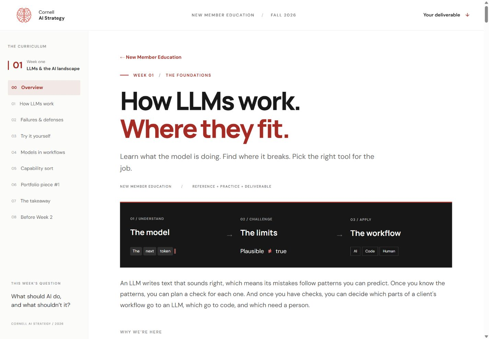
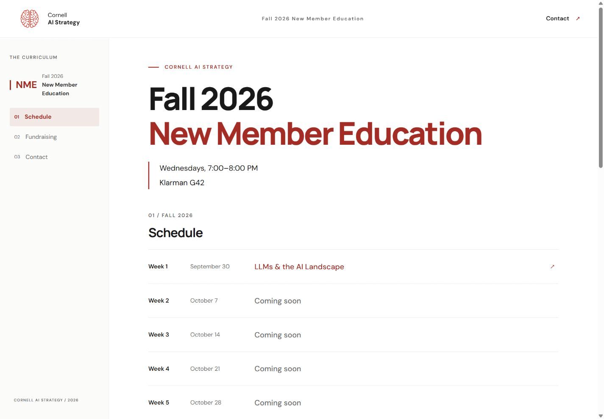
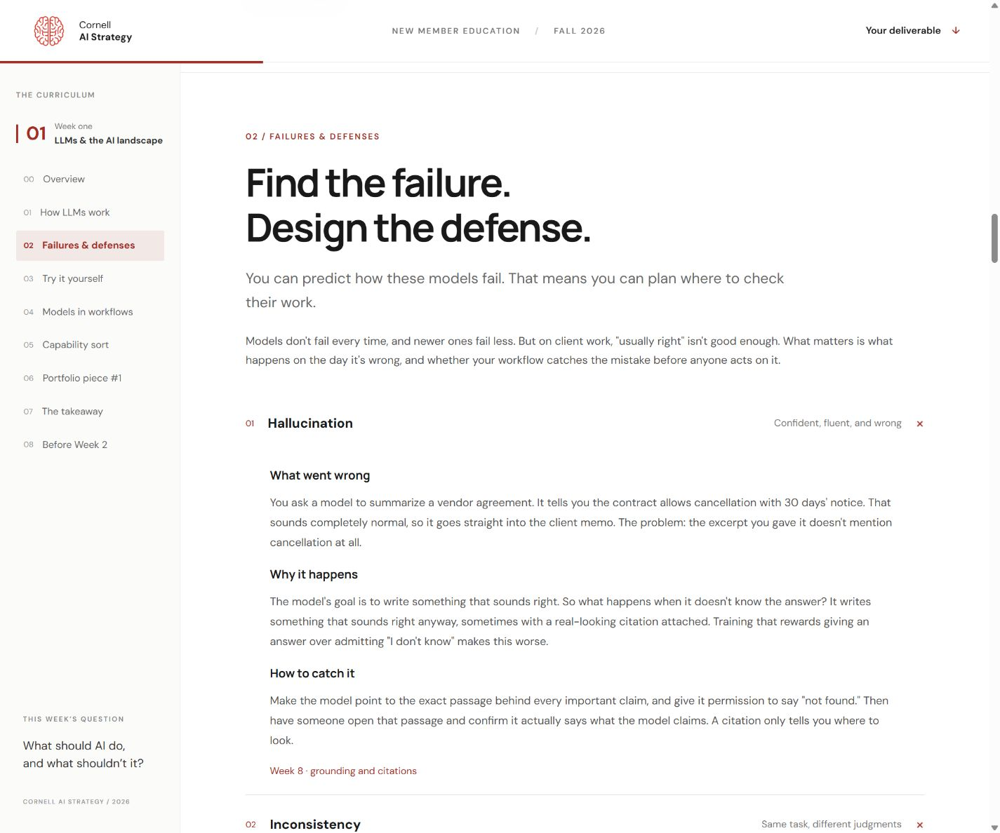
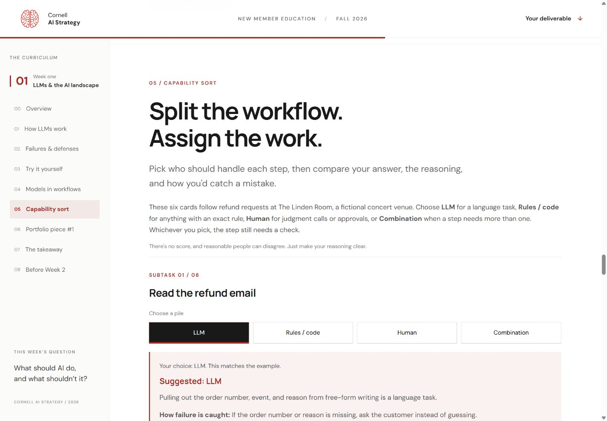
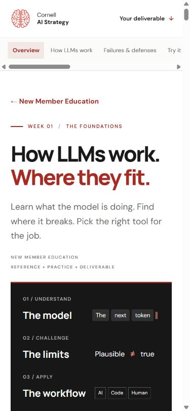

# Cornell AI Strategy · New Member Education

A 10-week curriculum and interactive course site that teaches new members of a student AI consulting club how to use AI responsibly in real client engagements.

[Live site](https://sallonikapoor.github.io/Cornell-AI-Strategy-NME/) · [Week 1 lesson](https://sallonikapoor.github.io/Cornell-AI-Strategy-NME/week-1/)



## About the project

Cornell AI Strategy (CAIS) is a student consulting club that delivers workflow automation, research, and go-to-market analysis through real client engagements. New members arrive with different backgrounds: some technical, some business-focused. They need a shared foundation quickly.

Designed and built by **Salloni Kapoor, Co-founder and Director of Technology & New Member Education at CAIS**. Fall 2026 cohort: **17** new members. The hub and Weeks 1–2 are available; Weeks 3–10 are in progress.

## The approach

- **One throughline:** LLMs generate plausible text → their failures follow predictable patterns → each failure needs a design defense → every workflow step gets assigned to an LLM, code, or a person, with a check attached.
- **Learn by breaking things:** members probe hallucination, inconsistent judgments, and arithmetic, then check the output against evidence. They run prompts in their own AI tool and return to the lesson to compare results.
- **Build a portfolio:** weekly portfolio pieces replace a single capstone. Members are already participating in real client engagements, so the curriculum gives them focused practice and work they can explain.
- **Confidentiality by design:** exercises use invented or public material. The curriculum prohibits putting client data into consumer AI tools.

## Curriculum

Fall 2026. This table is generated from the current [schedule data](src/data/weeks.json); upcoming topics remain labeled “Coming soon” until published there.

| Week | Date | Topic | Status |
| --- | --- | --- | --- |
| 1 | September 30 | LLMs & the AI Landscape | [Available](https://sallonikapoor.github.io/Cornell-AI-Strategy-NME/week-1/) |
| 2 | October 7 | [Scoping the Engagement](https://sallonikapoor.github.io/Cornell-AI-Strategy-NME/week-2/) | Available |
| 3 | October 14 | Coming soon | Upcoming |
| 4 | October 21 | Coming soon | Upcoming |
| 5 | October 28 | Coming soon | Upcoming |
| 6 | November 4 | Coming soon | Upcoming |
| 7 | November 11 | Coming soon | Upcoming |
| 8 | November 18 | Coming soon | Upcoming |
| 9 | December 2 | Coming soon | Upcoming |
| 10 | December 9 | Coming soon | Upcoming |

**No session on November 25 (Thanksgiving break).**

## Inside Week 1

- **Token prediction demo:** step through a scripted next-token loop to see how one prediction becomes context for the next.
- **Four failure modes:** example → cause → defense connects hallucination, inconsistency, unreliable math, and character errors to concrete checks.
- **Copyable practice prompts and collapsible answers:** test grounding, consistency, and math; optional citation and exact-string probes help distinguish convincing output from checked evidence.
- **Models in workflows:** compare chat, APIs, and agents to understand how information, tools, and approval decisions reach a model.
- **Six-card capability sort:** assign steps in a fictional venue’s refund process to LLM, rules/code, human, or combination; reveal the suggested approach, reasoning, and failure check.
- **Worked portfolio example:** an invented invoice-matching workflow shows how to justify each choice and design a review path before payment.
- **Four self-check questions:** reveal explanations that test whether members can distinguish a plausible answer from a verified result.

## Built with

**HTML / CSS / JavaScript · Node · GitHub Actions · Claude · Codex**

The site uses dependency-free HTML, CSS, and JavaScript. A Node 22 build script assembles pages from shared partials, versions assets, and validates local links, anchors, and duplicate IDs. GitHub Actions builds and deploys to GitHub Pages on pushes to `main`. Claude and Codex supported development; the site itself makes no model API calls.

Semantic HTML, keyboard-navigable controls, visible focus states, and reduced-motion styles support accessible use. The site has no tracking code or accounts. Week 2 stores its live-session roster, scores, and progress only in the current browser. The hub and Week 1 use Google Fonts with system-font fallbacks; Week 2 uses system fonts and works offline after its first load.

## Screenshots

### Hub



### Failure modes



### Capability sort



### Mobile



## Roadmap

Weeks 3–10 are in progress, with weekly releases planned through December 9, 2026, excluding Thanksgiving break.

## Run locally and add a week

With Node 22 and Python 3 installed, run from the repository root:

```sh
node scripts/build.mjs
python -m http.server 4174 --directory dist
```

Open the [local preview](http://localhost:4174/). No dependency installation is required. To add a week, start from the lesson template, register it, and update the schedule. See the [development guide](docs/DEVELOPMENT.md) for the full source map, steps, and publishing details.

## Contact

Salloni Kapoor · [sk3482@cornell.edu](mailto:sk3482@cornell.edu) · [confirm: LinkedIn URL] · [confirm: personal site, if any]

Week 2 includes a projector session and an unlisted facilitator script. See [the live-session guide](README-live-session.md) for setup, local state, timings, and controls.
